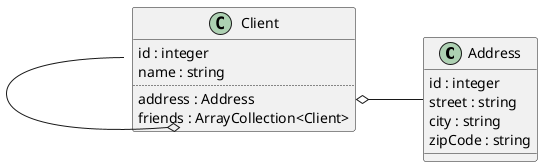

# Foundry

`Zenstruck Foundry` constitue une alternative aux `Doctrine Fixtures` qui automatise encore plus la création de données de test.

## Installation

La bibliothèque de base
```
composer require --dev zenstruck/foundry
```

Le bundle pour l'intégration dans Symfony
```
composer require --dev zenstruck/foundry-bundle
```

## Le principe

Foundry fonctionne avec des usines à objet (factories) qui définissent les données à insérer. Chaque usine est liée à une entité. Il est possible de créer ces classes à la main, mais `Maker` peut ici nous aider.

```
symfony console make:factory
```

### Un exemple de Factory

Imaginons une entité `Tag` ne possédant qu'une propriété `tagName`.

```php
namespace App\Factory;

use App\Entity\Tag;
use Zenstruck\Foundry\Persistence\PersistentProxyObjectFactory;

/**
 * @extends PersistentProxyObjectFactory<Tag>
 */
final class TagFactory extends PersistentProxyObjectFactory
{
    public function __construct()
    {
    }

    public static function class(): string
    {
        return Tag::class;
    }

    protected function defaults(): array|callable
    {
        return [
            'tagName' => self::faker()->text(30),
        ];
    }

    protected function initialize(): static
    {
        return $this
            // ->afterInstantiate(function(Tag $tag): void {})
        ;
    }
}
```

- La méthode `class` indique l'entité liée
- La méthode defaults retourne un tableau des valeurs par défaut de l'entité, notons ici que les usines intègrent un accès à `Faker`.

### Utilisation

L'objectif d'une usine est de créer des objets, pour cela `Foundry` propose des méthodes statiques.

- `createOne` : génère un objet
- `createMany` : génère plusieurs objets
- `createSequence` : génère une séquence d'objets
- `createRange` : génère un nombre aléatoire d'objets entre min et max
- `findOrCreate` : génère ou retourne une instance en fonction des données passées dans les critères.

#### Exemple

```php
// Génère un objet avec les valeurs par défaut
TagFactory::createOne();

// Génère un objet en fixant tout ou partie des valeurs
TagFactory::createOne(['tagName' => 'Angular']);

// Génère cinq objets avec les valeurs par défaut
TagFactory::createMany(5);

// Génère trois objets avec un tagName fixé
// en l'ocurrence ce n'est pas judicieux 
// car nous obtenons trois tags Laravel
tagFactory::createMany(3, ['tagName' => 'Laravel']);

// Génère une séquence d'objets avec des valeurs différentes
TagFactory::createSequence([
            ['tagName' => 'Symfony'],
            ['tagName' => 'PHP'],
            ['tagName' => 'JavaScript'],
            ['tagName' => 'Java'],
            ['tagName' => 'C#'],
]);

// Génère un nouveau tag s'il n'existe pas, 
// sinon retourne une instance du tag trouvé
tagFactory::findOrCreate(['tagName' => 'Laravel']);
```

L'appel à ces méthodes persiste automatiquement les entités (pas besoin d'EntityManager) et retourne une instance ou un tableau d'instances selon les cas.

### Utilisation dans les fixtures

```php
<?php

namespace App\DataFixtures;

use App\Factory\CommentFactory;
use App\Factory\PostFactory;
use App\Factory\PostThemeFactory;
use App\Factory\TagFactory;
use App\Factory\UserFactory;
use Doctrine\Bundle\FixturesBundle\Fixture;
use Doctrine\Persistence\ObjectManager;

class AppFixtures extends Fixture
{
    public function load(ObjectManager $manager): void
    {
        TagFactory::createOne(['tagName' => 'Angular']);
        
        TagFactory::createSequence([
            ['tagName' => 'Symfony'],
            ['tagName' => 'PHP'],
            ['tagName' => 'JavaScript'],
            ['tagName' => 'Java'],
            ['tagName' => 'C#'],
            ['tagName' => 'Flutter'],
            ['tagName' => 'Android'],
        ]);
    }
}
```

## La gestion des références

`Foundry` simplifie la gestion des références aux entités déjà persistées et propose des méthodes de sélections aléatoires.

- `random`, sélectionne aléatoirement une instance parmis les entités persistées.
- `randomRange(min, max)`, sélectionne entre min et max instances aléatoires d'une entité persistée.
- `randomSet(source)`, sélectionne une valeur aléatoire dans un tableau source. 
- `find(id)`, retourne une instance en fonction de son id.
- `findOne(crit)`, retourne une instance en fonction d'un tableau de critères.
- `findBy(crit)`, retourne un tableau d'instances en fonction d'un tableau de critères.

### Un exemple de gestion de références



#### Les factories

**L'adresse**

```php
namespace App\Factory;

use App\Entity\Tag;
use Zenstruck\Foundry\Persistence\PersistentProxyObjectFactory;

/**
 * @extends PersistentProxyObjectFactory<Tag>
 */
final class AddressFactory extends PersistentProxyObjectFactory
{
    public function __construct()
    {
    }

    public static function class(): string
    {
        return Address::class;
    }

    protected function defaults(): array|callable
    {
        // Valeurs aléatoires par défaut
        return [
            'street' => self::faker()->streetAddress(),
            'city' => self::faker()->city(),
            'zipCode' => self::faker()->postcode(),
        ];
    }

    protected function initialize(): static
    {
        return $this
            // ->afterInstantiate(function(Tag $tag): void {})
        ;
    }
}
```
**Le client**

```php
namespace App\Factory;

use App\Entity\Tag;
use Zenstruck\Foundry\Persistence\PersistentProxyObjectFactory;

/**
 * @extends PersistentProxyObjectFactory<Tag>
 */
final class ClientFactory extends PersistentProxyObjectFactory
{
    public function __construct()
    {
    }

    public static function class(): string
    {
        return Address::class;
    }

    protected function defaults(): array|callable
    {
        // Valeurs aléatoires par défaut
        return [
            'name' => self::faker()->name(),
            // Sélection aléatoire d'une ville
            'address' => AddressFactory::random(),
        ];
    }

    protected function initialize(): static
    {
        return $this
            // ->afterInstantiate(function(Tag $tag): void {})
        ;
    }
}
```
#### Les fixtures

```php
namespace App\DataFixtures;

use App\Factory\AddressFactory;
use App\Factory\ClientFactory;
use Doctrine\Bundle\FixturesBundle\Fixture;
use Doctrine\Persistence\ObjectManager;

class AppFixtures extends Fixture
{
    public function load(ObjectManager $manager): void
    {
        // Création d'une adresse en fixant toutes les données
        TagFactory::createOne([
            'street' => '3 rue de la grande truanderie',
            'zipCode' => '75003',
            'city' => 'Paris'
        ]);
        
        // Création de trois adresses à Paris, 
        // les autres données utiliseront les valeurs par défaut
        // de la factory
        TagFactory::createMany(3, [
            'city' => 'Paris'
        ]);
        
        // Création de dix adresses aléatoires
        TagFactory::createMany(10);
        
        // Création d'un client aléatoire
        ClientFactory::createOne();
        
        // Création de 10 clients aléatoires
        ClientFactory::createMany(10);
        
        // Création d'un client en fixant des valeurs
        // Ici la première adresse trouvée à Paris
        ClientFactory::createOne([
            'address' => AddressFactory::findOne(['city' => 'Paris']);
        ]);
        
        // Création d'un client en fixant des valeurs
        // Ici une adresse aléatoire
        ClientFactory::createOne([
            'address' => AddressFactory::random()
        ]);
        
        // Récupération de toutes les adresses à paris
        $addressesInParis = AddressFactory::findBy(
            ['city' => 'Paris']
        );
        
        // Création d'un client en fixant des valeurs
        // Ici une adresse aléatoire à Paris
        ClientFactory::createOne([
            'address' => AddressFactory::randomSet($addressesInParis)
        ]);
        
        // Création d'un client en fixant des valeurs
        // Ici un nombre aléatoire d'amis entre 1 et 5
        ClientFactory::createOne([
            'friends' => ClientFactory::randomRange(1, 5)
        ]);      
    }
}
```

> Attention : Dans le dernier cas, pour l'ajout d'amis, nous n'avons pas, à dessein, précisé de défaut dans ClientFactory. En effet cela aurait provoqué une référence circulaire et fait planter les fixtures.

