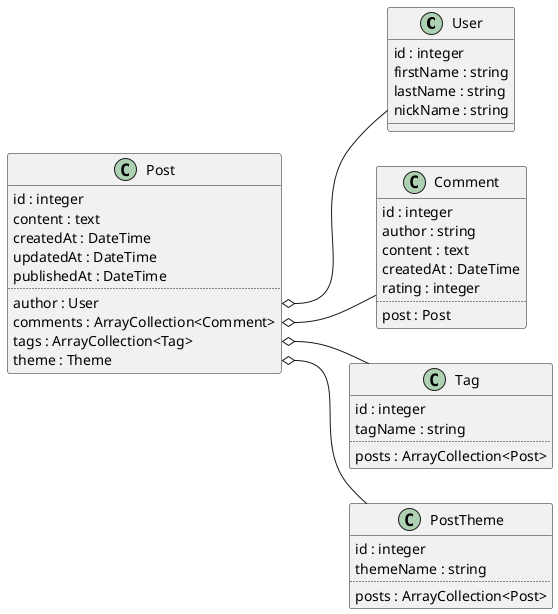

# La classe QueryBuilder

## Objectifs

- Identifier le rôle du `QueryBuilder`.
- Ajouter des requêtes personnalisées au `Repository` des entités.

## Principe

Comme son nom l'indique la classe `QueryBuilder`, permet de créer des requêtes et d'aller au-delà de ce que proposent les fonctions de base du `Repository`.

S'il est possible de créer une requête dans un contrôleur ou dans n'importe quel autre classe d'ailleurs, il est néanmoins fortement conseillé de centraliser les requêtes dans les classes `Repository`. De cette façon, nous saurons exactement où chercher les requêtes si jamais nous avons une modification à effectuer.


### Obtenir un instance de QueryBuilder

### Depuis une classe `Repository`

```php
$qb = $this->createQueryBuilder('a')
```

Le paramètre passé à la méthode représente l'alias de la classe à laquelle le `Repository` est lié. 

### Depuis n'importe où

Il nous faut une instance de la classe `EntityManager` et il faut également préciser l'entité sur laquelle nous souhaitons requêter. 

Cette façon de faire n'est cependant pas recommandée car on ne centralise pas les requêtes.

```php
public function query(
    EntityManagerInterface $manager)
{
    $qb = $manager->createQueryBuilder();
    $qb->select('u')->from(User::class, 'u');
}
```

## Notre bac à sable

Nous pouvons cloner ou télécharger le projet suivant pour nous entrainer à utiliser le QuerBuilder.

[Projet Blog](https://github.com/smaloron/symfony-blog)

### La Mise en place

```bash
composer install
```

```bash
docker compose up -d
```

```bash
symfony console doctrine:migrations:migrate
```

```bash
symfony console doctrine:fixtures:load
```

### Le diagramme de classe



## Quelques requêtes

### Une première requête simple

```php
// dans scr/Repository/PostRepository.php

public function findUnpublishedPosts(): array{
    // Création du QueryBuilder 
    // où p est un alias de l'entité Post
    $qb = $this ->createQueryBuilder('p');
    
    // Ajout dune clause WHERE
    // notons que nous utilisons les noms 
    // des propriétés de la classe
    // et pas ceux des colonnes
    $qb->where('p.publishedAt IS NULL');
    
    // Exécute la requête et retourne le résultat
    return $qb->getQuery()->getResult();
}
```

**Utilisation dans un contrôleur**

```php
// Dans src/Controller/PostController.php

#[Route('/post', name: 'app_post')]
    public function index(
        PostRepository $repository
    ): Response
    {

        $unpublished = $repository->findBy(['publishedAt' => null]);

        return $this->render('post/index.html.twig', [
            'unpublished' => $repository->findUnpublishedPosts(),
            'unpublished2' => $unpublished,
        ]);
    }
```

Comme nous le voyons, nous aurions pu obtenir le même résultat avec une méthode `findBy`. Ici l'intérêt du `QueryBuilder` réside dans l'auto documentation du code. 

L'appel à `findUnpublishedPosts` est plus explicite et peut-être que plus tard, nous voudrons changer les règles de sélection des posts non publiés.


Nous constatons ici que la requête retourne un tableau d'entités

### Requête paramètrée

Pour éviter les problèmes d'injection SQL nous utilisons systématiquement des marqueurs et passons les valeurs des paramètres avec un appel à la méthode `setParameter`. 

```php
// dans scr/Repository/PostRepository.php

public function findPostByTheme(Theme $theme)
{
    return $this->createQueryBuilder('p')
                ->where('p.theme = :theme')
                ->setParameter('theme', $theme)
                ->getQuery()->getResult();
}
```

Ici encore, un simple `findBy` aurait produit le même résultat.

### Requête paramétrée autre syntaxe

Plutôt qu'une chaîne de caractère, nous pouvons utiliser des entiers en guise de marqueurs.

```php
// dans scr/Repository/PostRepository.php

public function findPostByTheme(Theme $theme)
{
    return $this->createQueryBuilder('p')
                ->where('p.theme = ?1')
                ->setParameter(1, $theme)
                ->getQuery()->getResult();
}
```

### Jointures

Le code des jointures est très différent de ce que nous connaissons avec SQL. QueryBuilder requête sur des entités et les conditions de jointure sont déjà définies au sein de l'association. 

Pour faire une jointure, il suffit donc de préciser le nom de la propriété qui porte l'association au sein de la classe propriétaire et de donner un alias à cette entité liée.

```php
// dans scr/Repository/PostRepository.php

public function findPostsByThemeName(string $name)
{
    return $this->createQueryBuilder('p')
                ->join('p.theme', 't')
                ->where('t.themeName = :theme')
                ->setParameter('theme', $name)
                ->getQuery()->getResult();
}
```

**Le contrôleur**

```php
#[Route(
    '/post/by-them/{themeName}', 
    name: 'app_post_by_theme_name'
)]
public function byThemeName(
    PostRepository $repository,
    string $themeName
): Response
{
    return $this->render('post/index.html.twig', [
        'posts' => $repository->findPostsByThemeName($themeName),
        'themeName' => $themeName,
    ]);
}
```

## Les Méthodes du QueryBuilder

Résumé des Méthodes Principales

| Méthode               | Description                     |
|-----------------------|---------------------------------|
| select(), addSelect() | Sélection des champs/colonnes   |
| from()                | Source de données               |
| where()               | Ajout de conditions simples     |
| andWhere()            | Conditions supplémentaires (ET) |
| orWhere()             | Conditions supplémentaires (OU) |
| join(), leftJoin()    | Jointure entre entités          |
| groupBy()             | Regroupement                    |
| having()              | Conditions après regroupement   |
| orderBy()             | Tri des résultats               |
| setFirstResult()      | Offset (pagination)             |
| setMaxResults()       | Limite de résultats             |

### Select

Si nous ne sélectionnons que quelques éléments d'une entité, le résultat ne sera plus un tableau d'entités, mais un simple tableau ordinal de tableaux associatifs.

```php
public function findOnlyIdAnTitle(): array{
        $qb = $this->createQueryBuilder('p')
            ->select('p.id', 'p.title')
        return $qb->getQuery()->getResult();
    }
```


La méthode `addSelect` permet d'ajouter des éléments à une séléction dèja établie, très utile lorsque l'on veut ajouter des éléments en fonction d'une condition (pour un formulaire de recherche par exemple).

## Group By

Notons que Doctrine supporte les fonctions d'agrégation `SQL`. Le regroupement consolidant les données de plusieurs entités, le résultat sera une collection de tableaux associatifs.

```php
// Dans src/Repository/TagRepository.php

public function countPostsByTags(): array{
    return $this->createQueryBuilder('t')
        ->select('t.tagName, COUNT(p.id) as postCount')
        ->Join('t.posts', 'p')
        ->groupBy('t.id')
        ->getQuery()
        ->getResult();
}
```


## La récupération des résultats

La méthode `getResult` tente de retourner un tableau d'entités (nous avons vu qu'il est des cas où elle ne peut le faire). Il existe cependant d'autres méthodes de récupération.

`getOneOrNullResult()`
: Récupère un seul résultat sous la forme d'une entité ou null s'il n'y a pas de données.
: Si la requête contient plus d'une ligne alors une exception `NonUniqueResultException` est levée. 

`getSingleResult()`
: Récupère un seul résultat sous la forme d'une entité.
: Si la requête contient plus d'une ligne, une exception `NonUniqueResultException` est levée.
: Si la requête ne contient pas de données, une exception `NoResultException` est levée.

`getArrayResult()`
: Récupère les résultats sous la forme d'un tableau ordinal de tableaux associatifs
: Dans le cas de développement d'une API, il est plus simple de sérialiser un tel tableau en JSON

`getSingleScalarResult()`
: Récupère une seule valeur
: Si la requête ne contient pas de données, une exception `NoResultException` est levée.

`getScalarResult()`
: Récupère une ligne sous la forme d'un tableau associatif


`getSingleColumnResult()`
: Récupère les valeurs d'une seule colonne sous forme de tableau.
```php
$qb = $this->createQueryBuilder('p')
->select('p.title');
$titles = $qb->getQuery()->getSingleColumnResult();
```

`iterate()`
: Permet d'itérer sur les résultats sans les charger tous en mémoire (utile pour de grandes quantités de données).
```php
$qb = $this->createQueryBuilder('p')
            ->where('p.publishedAt IS NOT NULL')
$iterableResult = $qb->getQuery()->iterate();
foreach ($iterableResult as $row) {
    $post = $row[0];
    // Traitez chaque entité ici
}
```

`toIterable()`
: Similaire à iterate(), mais plus simple d’utilisation.
```php
$qb = $this->createQueryBuilder('p')
            ->where('p.publishedAt IS NOT NULL')
foreach ($qb->getQuery()->toIterable() as $post) {
    // Traitez chaque entité ici
}
```

## Exercices

- Afficher la liste des auteurs ayant posté sur un tag passé en argument.
- Afficher le pourcentage de posts non encore publiés.
- Afficher les n derniers commentaires (n étant passé en argument).
